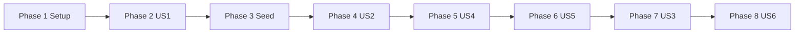

# Tasks: Support Ticket Management

**Input**: Design documents from `/specs/001-support-ticket-management/`

**Prerequisites**: plan.md, spec.md, research.md, data-model.md, contracts/, quickstart.md

**Tests**: Included. `plan.md` and `specs/test-strategy.md` name the backend tests. There is no frontend test framework in this feature.

**Organization**: Eight phases, one per implementation slice in `plan.md`. Each phase is one conventional commit. Do not commit between tasks inside a phase. Do not split a slice across commits.

## Format: `[ID] [P?] [Story] Description`

- **[P]**: Can run in parallel (different files, no dependency on an incomplete task)
- **[Story]**: User story label. Setup and Seed have none.
- Every task includes a file path.

## Path Conventions

- Backend: `backend/src/main/java/com/ticketmanagement/`, `backend/src/main/resources/`, `backend/src/test/java/com/ticketmanagement/`
- Frontend: `frontend/src/`
- Web app: `backend/` and `frontend/` at the repository root, plus root `docker-compose.yml`

## Commit rule

Finish the tasks in a phase, then make one commit for that phase, then start the next phase. Suggested messages are on each checkpoint. Later slices stay runnable without unfinished stories. Out of scope for every phase: sign-in, Spring AI, Ollama, embeddings, and the `vector` extension.

---

## Phase 1: Setup (Slice 1)

**Purpose**: Compose, Maven and Vite skeletons, problem-detail handler, CORS for `http://localhost:5173`, Flyway `V1` schema with no seed rows, and an app that boots.

**Independent Test**: `docker compose up -d` starts PostgreSQL from `pgvector/pgvector:pg16`. The API starts on port 8080, Flyway applies `V1` only, and Hibernate `ddl-auto: validate` passes. The UI dev server listens on port 5173.

**Commit**: `chore: scaffold api, ui, and local database`

### Implementation for Setup

- [X] T001 [P] Create `docker-compose.yml` at the repository root with image `pgvector/pgvector:pg16`, database name `tickets`, user `tickets`, and password `${TICKETS_DB_PASSWORD:-tickets}`. Publish port 5432. Use a named volume so data survives a container restart. Do not create the `vector` extension. The password `tickets` is the published local placeholder only, overridable with `TICKETS_DB_PASSWORD`.
- [X] T002 [P] Create `backend/pom.xml` for Java 21 and Spring Boot 3.5 with starters `web`, `validation`, `data-jpa`, and `flyway`, plus the PostgreSQL driver. Test scope: `spring-boot-starter-test`, `org.springframework.boot:spring-boot-testcontainers`, `org.testcontainers:junit-jupiter`, and `org.testcontainers:postgresql`. Do not add Spring AI or an HTTP client library.
- [X] T003 [P] Create `backend/src/main/java/com/ticketmanagement/TicketManagementApplication.java` with `@SpringBootApplication`.
- [X] T004 [P] Create `backend/src/main/resources/application.yml` with server port 8080, datasource URL for the local `tickets` database, username `tickets`, password `${TICKETS_DB_PASSWORD:tickets}`, `spring.jpa.hibernate.ddl-auto: validate`, `spring.flyway.locations: classpath:db/migration`, `spring.jackson.deserialization.fail-on-unknown-properties: true`, and `spring.mvc.problemdetails.enabled: true`. Do not add the seed location in this phase.
- [X] T005 [P] Create `backend/src/main/resources/db/migration/V1__create_ticket_schema.sql`. Create sequence `ticket_number_seq` starting at 1001. Create `tickets` with `id bigint generated always as identity primary key`, `ticket_number integer not null unique`, `ticket_id varchar(16) not null unique`, `title varchar(200) not null`, `description varchar(5000) not null`, `priority varchar(16) not null` limited to `LOW`, `MEDIUM`, `HIGH`, `assignee varchar(200) not null`, `category varchar(100) not null`, `resolution_notes varchar(5000) null`, `status varchar(16) not null` limited to `OPEN`, `IN_PROGRESS`, `RESOLVED`, `CLOSED`, `CANCELLED`, and `created_at timestamptz not null default now()`. Add a before-insert trigger: when `ticket_number` is null, set it from `nextval('ticket_number_seq')`; always set `ticket_id` to `TKT-` plus `ticket_number`. Do not allocate ids with max-plus-one. Index `(created_at DESC, ticket_number DESC)`. Create `comments` with `id bigint generated always as identity primary key`, `ticket_id bigint not null references tickets (id)`, `text varchar(5000) not null`, and `created_at timestamptz not null default now()`. No seed rows. Later migrations start at `V3`.
- [X] T006 Create `backend/src/main/java/com/ticketmanagement/common/TicketNotFoundException.java` and `backend/src/main/java/com/ticketmanagement/common/ApiExceptionHandler.java`. The handler is a `@ControllerAdvice` at highest precedence so it replaces the default problem body. Map `TicketNotFoundException` to a ProblemDetail 404 whose `detail` is `Ticket {ticketId} was not found.` Map `MethodArgumentNotValidException` to a ProblemDetail 400 that includes `errors: [{ field, message }]` using the JSON property name and the annotation message. Map `HttpMessageNotReadableException` to a ProblemDetail 400 whose `detail` names the offending property, walking the Jackson cause chain: unknown property (`UnrecognizedPropertyException`) → `Unknown property '{name}'`; explicit null (`InvalidNullException` from `@JsonSetter(nulls = Nulls.FAIL)`) → `Property '{name}' must not be null`; bad enum (`InvalidFormatException`) → `Invalid value for property '{name}'`. Also map `MethodArgumentTypeMismatchException` with that same invalid-value detail, using the parameter name. Every error body has `title`, `status`, `detail`, and `instance`. Never include a stack trace, an exception class name, or a secret.
- [X] T007 [P] Create `backend/src/main/java/com/ticketmanagement/common/WebConfig.java` allowing CORS only for origin `http://localhost:5173` on `/api/**` for GET, POST, PATCH, and OPTIONS. CORS also sets `exposedHeaders("Location")`.
- [X] T008 [P] Create the Vite React TypeScript skeleton: `frontend/package.json`, `frontend/vite.config.ts` (port 5173), `frontend/tsconfig.json`, `frontend/index.html`, `frontend/src/main.tsx`, and `frontend/src/App.tsx` with `react-router` installed and no routes yet. HTTP calls later use `fetch`. Do not add a second HTTP library or a frontend test runner.

**Checkpoint**: API and UI boot. Commit this phase alone before Phase 2.

---

## Phase 2: User Story 1 - Create and view a ticket (Slice 2) (Priority: P1) MVP

**Goal**: An agent creates a ticket and opens it again. The first id on an empty database is TKT-1001, the next is TKT-1002, the status is OPEN, and blank resolution notes are allowed. The create form names each invalid field.

**Independent Test**: With no tickets, submit title, description, priority, assignee, and category. The response is 201, `Location` is `/api/tickets/TKT-1001`, and the detail screen shows that id, the saved fields, status OPEN, and empty notes. A second create returns TKT-1002. A blank required field is 400 and nothing is saved.

### Tests for User Story 1

> Write these first. They must fail before the controller accepts invalid bodies or drops unknown properties.

- [X] T009 [US1] Create `backend/src/test/java/com/ticketmanagement/ticket/TicketValidationTest.java` as `@WebMvcTest(controllers = TicketController.class, properties = "spring.jackson.deserialization.fail-on-unknown-properties=true")` with `@MockitoBean` on `TicketService`. Assert `ApiExceptionHandler` supplies the body. For `POST /api/tickets`: whitespace-only or blank `title`, `description`, `assignee`, and `category` return 400 with one `errors` entry per field and messages `Title is required`, `Description is required`, `Assignee is required`, and `Category is required`; omitted `priority` returns 400 `Priority is required`; `title` longer than 200, `assignee` longer than 200, `category` longer than 100, `description` longer than 5000, and `resolutionNotes` longer than 5000 each return 400 naming that field (`Title must be at most 200 characters`, `Assignee must be at most 200 characters`, `Category must be at most 100 characters`, `Description must be at most 5000 characters`, `Resolution notes must be at most 5000 characters`). A body with `priority` `URGENT` returns 400 ProblemDetail `detail` `Invalid value for property 'priority'`. A body that also contains `status` or `ticketId` returns 400 `detail` `Unknown property 'status'` or `Unknown property 'ticketId'`. When `TicketService` throws `TicketNotFoundException` for `GET /api/tickets/TKT-9999`, the response is 404 `detail` `Ticket TKT-9999 was not found.` and the body has no stack trace. On every 400 case, `verifyNoInteractions` on the service mock. Constraints: title `varchar(200)` required, trimmed, blank rejected; description `varchar(5000)` required, trimmed, blank rejected; assignee `varchar(200)` required, trimmed, blank rejected; category `varchar(100)` required, trimmed, blank rejected; priority `LOW`, `MEDIUM`, or `HIGH`; resolutionNotes `varchar(5000)` optional.

### Implementation for User Story 1

- [X] T010 [P] [US1] Create `backend/src/main/java/com/ticketmanagement/ticket/TicketPriority.java` with values `LOW`, `MEDIUM`, and `HIGH` only.
- [X] T011 [P] [US1] Create `backend/src/main/java/com/ticketmanagement/ticket/TicketStatus.java` with values `OPEN`, `IN_PROGRESS`, `RESOLVED`, `CLOSED`, and `CANCELLED`. Do not add the transition map in this phase.
- [X] T012 [P] [US1] Create `backend/src/main/java/com/ticketmanagement/ticket/dto/CreateTicketRequest.java` with trimmed `title` (`@NotBlank` max 200, message `Title is required` / `Title must be at most 200 characters`), `description` (`@NotBlank` max 5000), `priority` (`@NotNull`, message `Priority is required`), `assignee` (`@NotBlank` max 200), `category` (`@NotBlank` max 100), and optional `resolutionNotes` (max 5000). Trim before validation. A value that is only spaces is blank. Do not declare `status` or `ticketId`. Omitted or blank `resolutionNotes` means none.
- [X] T013 [P] [US1] Create `backend/src/main/java/com/ticketmanagement/comment/dto/CommentResponse.java` (`id`, `text`, `createdAt`) and `backend/src/main/java/com/ticketmanagement/ticket/dto/TicketDetail.java` with `ticketId`, `title`, `description`, `priority`, `assignee`, `category`, `resolutionNotes` (null when none), `status`, `createdAt`, and `comments`. Do not add `allowedNextStatuses` until Slice 4.
- [X] T014 [US1] Create `backend/src/main/java/com/ticketmanagement/ticket/Ticket.java` mapped to `tickets`. `id` uses `@GeneratedValue(strategy = IDENTITY)`. `ticketNumber` and `ticketId` are set by the V1 trigger: map them with Hibernate `@Generated(event = EventType.INSERT)` and `@Column(insertable = false, updatable = false)` so the saved entity has `ticketId` populated before the controller builds `Location`. `title` max 200, `description` max 5000, `assignee` max 200, `category` max 100, `resolutionNotes` max 5000 nullable, `priority` and `status` required, `createdAt` set once and not updated. New rows start as `OPEN`.
- [X] T015 [US1] Create `backend/src/main/java/com/ticketmanagement/ticket/TicketRepository.java` with `findByTicketId` and save. Do not add the list query here.
- [X] T016 [US1] Implement create and get in `backend/src/main/java/com/ticketmanagement/ticket/TicketService.java`. Create persists a trimmed ticket, leaves `ticketNumber` null so the V1 trigger assigns `TKT-1001` then `TKT-1002`, and sets status `OPEN`. Never reuse a number and never compute max id plus one. Omitted or blank resolution notes are stored as null. Get returns comments as an empty list until Slice 6. Unknown `ticketId` throws `TicketNotFoundException`.
- [X] T017 [US1] Implement `POST /api/tickets` and `GET /api/tickets/{ticketId}` in `backend/src/main/java/com/ticketmanagement/ticket/TicketController.java`. Create returns 201, `Location: /api/tickets/{ticketId}`, and a `TicketDetail`. Validate the request body before the service runs. Get returns 200 or 404.
- [X] T018 [P] [US1] Add `createTicket` and `getTicket` to `frontend/src/api/tickets.ts` using `fetch` against `http://localhost:8080`. Types use the create and detail fields from `contracts/tickets.openapi.yaml`.
- [X] T019 [P] [US1] Create `frontend/src/pages/TicketCreatePage.tsx`. Required fields: title, description, priority, assignee, category. Resolution notes are optional. Priority options are Low, Medium, and High for `LOW`, `MEDIUM`, and `HIGH`. On 201, open `/tickets/{ticketId}` from `Location` or `ticketId`. On 400, show each `errors[].message` next to `errors[].field` and stay on the form.
- [X] T020 [US1] Create `frontend/src/pages/TicketDetailPage.tsx` showing human id, title, description, priority label, assignee, category, status text, resolution notes, created time, and `comments` in API order. On 404, show `detail`. Do not add the edit form, status control, or comment box in this phase. Register `/tickets/new` and `/tickets/:ticketId` in `frontend/src/App.tsx`.

**Checkpoint**: Create and view work on an empty database. Commit: `feat: create and view a support ticket`

---

## Phase 3: Seed (Slice 3)

**Purpose**: Flyway `V2` loads the fifteen tickets from `data-model.md`, and the next created id is TKT-1016. Tests still run `V1` only.

**Independent Test**: Start the app against the compose database. Rows TKT-1001 through TKT-1015 exist, created times increase by one minute with the id, and `ticket_number_seq`’s next `nextval` is 1016. `mvn test` still uses an empty database whose first id is TKT-1001.

**Commit**: `chore: seed fifteen support tickets`

### Implementation for Seed

- [ ] T021 [P] Create `backend/src/test/resources/application.yml` with `spring.flyway.locations: classpath:db/migration` so tests never apply the seed.
- [ ] T022 Add `classpath:db/seed` to `spring.flyway.locations` in `backend/src/main/resources/application.yml`, after `classpath:db/migration`. Leave the test location as migration only.
- [ ] T023 [P] Create `backend/src/main/resources/db/seed/V2__seed_tickets.sql` inserting these rows. Category is the theme. Assignee is `Alex Kim` on every row (the seed table does not name one; do not put that name in a title or description). `created_at` starts at `2026-01-15T12:00:00Z` for TKT-1001 and increases by one minute per id so TKT-1015 is newest. Copy titles, descriptions, priorities, and statuses exactly. After the inserts, `SELECT setval('ticket_number_seq', 1015)` so the next `nextval` is 1016. Insert a comment only where listed, with `created_at` equal to the ticket:

  | ticketId | category | title | description | priority | status | resolution notes | comment text |
  |----------|----------|-------|-------------|----------|--------|------------------|--------------|
  | TKT-1001 | Payment | Payment declined at checkout | Card network returned a payment failure during checkout. | HIGH | OPEN | none | `Noted.` |
  | TKT-1002 | Payment | Customer charged twice for one order | A second capture was taken for the same order. | HIGH | IN_PROGRESS | none | `The duplicate capture is being traced.` |
  | TKT-1003 | Payment | Refund still missing after five days | The refund has not appeared after five days. | MEDIUM | RESOLVED | `The refund posted.` | `Noted.` |
  | TKT-1004 | Payment | Invoice shows the wrong currency | The invoice used USD instead of EUR. | LOW | CLOSED | `The invoice was reissued.` | none |
  | TKT-1005 | Payment | Duplicate payment report, already handled | Caller confirmed this report is a duplicate. | MEDIUM | CANCELLED | none | none |
  | TKT-1006 | Shipment | Shipment has not moved in four days | No carrier scan since handover. | HIGH | OPEN | none | `The carrier scan gap is still open.` |
  | TKT-1007 | Shipment | Tracking number does not update | The tracking page has shown the same scan for two days. | MEDIUM | IN_PROGRESS | none | `The carrier was contacted.` |
  | TKT-1008 | Shipment | Parcel delivered to the wrong address | The parcel was left at a neighboring building. | HIGH | RESOLVED | `A replacement was sent.` | none |
  | TKT-1009 | Shipment | Delivery scan missing after handoff | The handoff scan was never recorded. | LOW | CLOSED | `The scan was corrected.` | none |
  | TKT-1010 | Shipment | Shipment cancelled by the customer | The customer asked to stop this shipment. | LOW | CANCELLED | none | none |
  | TKT-1011 | Login | Cannot sign in after a password reset | The reset mail arrived but sign-in still fails. | HIGH | OPEN | none | `The reset mail arrived.` |
  | TKT-1012 | Login | MFA code is rejected | The one-time code is rejected as expired. | MEDIUM | IN_PROGRESS | none | `A new code was requested.` |
  | TKT-1013 | Login | Account locked after failed attempts | Too many failed sign-in attempts locked the account. | HIGH | RESOLVED | `The lock was cleared.` | none |
  | TKT-1014 | Login | SSO redirect loop on the login page | The login page repeats the same redirect. | MEDIUM | CLOSED | `The redirect URL was corrected.` | none |
  | TKT-1015 | Login | Second report of the password-reset failure | Same reset problem already tracked on TKT-1011. | LOW | CANCELLED | none | `Same reset problem already tracked on TKT-1011.` |

  Search checks these strings must keep: `pay` occurs only in TKT-1001 and TKT-1005 titles or descriptions; `password` does not contain `pay`; `page` does not contain `pay`.

**Checkpoint**: Seeded app has TKT-1001 through TKT-1015 and the next id is TKT-1016. Commit: `chore: seed fifteen support tickets`

---

## Phase 4: User Story 2 - Move a ticket through its allowed statuses (Slice 4) (Priority: P1)

**Goal**: Status changes only through `PATCH /api/tickets/{ticketId}/status`. The `TicketStatus` map is the only copy. The screen offers `allowedNextStatuses` and shows the 409 explanation.

**Independent Test**: Each allowed next status succeeds. A status that is not allowed, including a change to the current status, returns 409, the stored status is unchanged, and the screen shows `detail`. CLOSED and CANCELLED offer no next status.

### Tests for User Story 2

> Write these first. The status endpoint is not done until T024, T025, and T026 pass.

- [ ] T024 [P] [US2] Create `backend/src/test/java/com/ticketmanagement/ticket/TicketStatusTest.java` as plain JUnit 5 with no Spring. Assert `allowedNext` is exactly: `OPEN` → `IN_PROGRESS`, `CANCELLED`; `IN_PROGRESS` → `RESOLVED`, `CANCELLED`; `RESOLVED` → `CLOSED`; `CLOSED` → none; `CANCELLED` → none. Every other pair, including a request to keep the same status, is refused. Cover this matrix:

  | From \ To | OPEN | IN_PROGRESS | RESOLVED | CLOSED | CANCELLED |
  |-----------|------|-------------|----------|--------|-----------|
  | OPEN | refuse | allow | refuse | refuse | allow |
  | IN_PROGRESS | refuse | refuse | allow | refuse | allow |
  | RESOLVED | refuse | refuse | refuse | allow | refuse |
  | CLOSED | refuse | refuse | refuse | refuse | refuse |
  | CANCELLED | refuse | refuse | refuse | refuse | refuse |

- [ ] T025 [P] [US2] Create `backend/src/test/java/com/ticketmanagement/ticket/TicketStatusTransitionTest.java` as `@SpringBootTest` with `@AutoConfigureMockMvc`. Build the container as `new PostgreSQLContainer<>(DockerImageName.parse("pgvector/pgvector:pg16").asCompatibleSubstituteFor("postgres"))` with `@ServiceConnection`. Docker must be running for `mvn test`. Also assert a ticket saved through the repository has a non-null `ticketId`. Flyway location stays `classpath:db/migration`. One `@ParameterizedTest` of the 25 pairs above. Each case inserts a ticket already in the source status through `TicketRepository`, calls `PATCH /api/tickets/{ticketId}/status`, then reads the row back. The five allowed pairs return 200 and the target status. The twenty others return 409, ProblemDetail `detail` `Changing status from {FROM} to {TO} is not allowed.`, and the original status still stored. `PATCH /api/tickets/TKT-9999/status` with a real status name returns 404 and does not insert a row.
- [ ] T026 [P] [US2] Add these cases to `backend/src/test/java/com/ticketmanagement/ticket/TicketValidationTest.java`: `PATCH /api/tickets/TKT-1001/status` with `{ "status": "DONE" }` returns 400 ProblemDetail `detail` `Invalid value for property 'status'`; a body with `status` plus `title` returns 400 `detail` `Unknown property 'title'`; omitted `status` returns 400 with `errors` field `status` and message `Status is required`. The `TicketService` mock is not called.

### Implementation for User Story 2

- [ ] T027 [US2] Add the only transition map to `backend/src/main/java/com/ticketmanagement/ticket/TicketStatus.java` as `allowedNext()`, matching the sets in T024. `OPEN` allows `IN_PROGRESS` and `CANCELLED`. `IN_PROGRESS` allows `RESOLVED` and `CANCELLED`. `RESOLVED` allows `CLOSED`. `CLOSED` and `CANCELLED` allow none.
- [ ] T028 [P] [US2] Create `backend/src/main/java/com/ticketmanagement/ticket/dto/StatusChangeRequest.java` with required `status` (`@NotNull`, message `Status is required`) and no other property. Create `backend/src/main/java/com/ticketmanagement/ticket/StatusChangeNotAllowedException.java` carrying the current status and the requested status.
- [ ] T029 [US2] In `backend/src/main/java/com/ticketmanagement/common/ApiExceptionHandler.java`, map `StatusChangeNotAllowedException` to ProblemDetail 409 whose `detail` is `Changing status from {FROM} to {TO} is not allowed.` Do not change the stored row in the handler.
- [ ] T030 [US2] Implement `changeStatus` in `backend/src/main/java/com/ticketmanagement/ticket/TicketService.java`. Unknown `ticketId` throws `TicketNotFoundException`. A target in `allowedNext()` is saved. Every other pair, including the current status, throws `StatusChangeNotAllowedException` and leaves the row unchanged. This is the only status write.
- [ ] T031 [US2] Add `PATCH /api/tickets/{ticketId}/status` to `backend/src/main/java/com/ticketmanagement/ticket/TicketController.java`. Allowed changes return 200 and `TicketDetail`. Add `allowedNextStatuses` to `backend/src/main/java/com/ticketmanagement/ticket/dto/TicketDetail.java`, copied from `TicketStatus.allowedNext()` for the stored status.
- [ ] T032 [US2] Add `changeStatus` to `frontend/src/api/tickets.ts`. On `frontend/src/pages/TicketDetailPage.tsx`, list only `allowedNextStatuses`. `CLOSED` and `CANCELLED` show no next status. Submit `PATCH /api/tickets/{ticketId}/status`. On 409, show `detail` and keep the status that was loaded. Do not copy the transition map into the UI.

**Checkpoint**: All 25 pairs behave as the matrix says. Commit: `feat: enforce allowed ticket status changes`

---

## Phase 5: User Story 4 - Correct ticket details (Slice 5) (Priority: P2)

**Goal**: An agent can change title, description, priority, assignee, and resolution notes in every status, including CLOSED and CANCELLED. Human id, category, status, and created time stay as they were. An omitted property is unchanged. An explicit JSON null is 400. `resolutionNotes: ""` clears the notes.

**Independent Test**: Edit each allowed field, save, and reload. The new values stick. Category, human id, and status do not change. The same edits succeed on a CLOSED ticket and on a CANCELLED ticket. `PATCH /api/tickets/{ticketId}` with a `status` property returns 400 and does not change the ticket.

### Tests for User Story 4

> Write these first. They must fail before the update DTO rejects `status`, explicit null, and blank fields.

- [ ] T033 [US4] Add this case to `backend/src/test/java/com/ticketmanagement/ticket/TicketValidationTest.java`: `PATCH /api/tickets/TKT-1001` with body `{ "status": "CLOSED" }` returns 400 ProblemDetail whose `detail` is `Unknown property 'status'`. The `TicketService` mock is not called. This must not be a 409 and must not call a status change.
- [ ] T034 [US4] Add these cases to the same `backend/src/test/java/com/ticketmanagement/ticket/TicketValidationTest.java`. Explicit `{ "title": null }` returns 400 `detail` `Property 'title' must not be null`. `{ "category": "Billing" }` returns 400 `detail` `Unknown property 'category'`. A present blank or whitespace-only `title`, `description`, or `assignee` returns 400 with that field in `errors` and the same required messages as create. A present `title` longer than 200, `description` longer than 5000, `assignee` longer than 200, or `resolutionNotes` longer than 5000 returns 400 naming that field. `priority` `URGENT` returns 400 `detail` `Invalid value for property 'priority'`. The service mock is not called. Quote the update rule in the test name: an omitted property stays unchanged; an explicit JSON null is rejected; `status`, `category`, `ticketId`, and any other unknown property are rejected.

### Implementation for User Story 4

- [ ] T035 [US4] Create `backend/src/main/java/com/ticketmanagement/ticket/dto/UpdateTicketRequest.java` with only `title`, `description`, `priority`, `assignee`, and `resolutionNotes`. Put `@JsonSetter(nulls = Nulls.FAIL)` on each property so an omitted property deserializes as Java null and an explicit JSON null fails before the service. Do not use `@NotBlank` on these fields (null means omitted and is valid). When a value is present, trim it; a blank `title`, `description`, `assignee`, or `priority` is 400 with the create messages; max lengths stay 200, 5000, 200, and 5000 for title, description, assignee, and resolution notes. `resolutionNotes` of `""` is valid and means clear. Do not declare `status`, `category`, or `ticketId`.
- [ ] T036 [US4] Implement update in `backend/src/main/java/com/ticketmanagement/ticket/TicketService.java`. Apply only properties that were present. `resolutionNotes` `""` stores null. Do not change `ticketId`, `ticketNumber`, `category`, `status`, or `createdAt`. Allow the update when status is `CLOSED` or `CANCELLED`. Unknown `ticketId` throws `TicketNotFoundException`.
- [ ] T037 [US4] Add `PATCH /api/tickets/{ticketId}` to `backend/src/main/java/com/ticketmanagement/ticket/TicketController.java`. Success returns 200 and `TicketDetail`.
- [ ] T038 [US4] Add `updateTicket` to `frontend/src/api/tickets.ts` and an edit form on `frontend/src/pages/TicketDetailPage.tsx` for title, description, priority, assignee, and resolution notes. Do not send `status` or `category`. On 400, show each `errors[].message` next to `errors[].field` and keep the unsaved values. The form stays available when the ticket is CLOSED or CANCELLED.

**Checkpoint**: Field edits stick and cannot change status or category. Commit: `feat: update editable ticket fields`

---

## Phase 6: User Story 5 - Add a comment (Slice 6) (Priority: P3)

**Goal**: An agent appends a non-empty comment on any ticket, including CLOSED and CANCELLED. Comments stay in the order they were added. A blank comment is refused and the status does not change.

**Independent Test**: Add a comment, leave, and open the ticket again. It is still there, after older comments, with its time. An empty comment is not added, and the screen says the comment needs text. Adding a comment on TKT-1004 leaves status CLOSED.

### Tests for User Story 5

> Write this first. It must fail before blank text is rejected.

- [ ] T039 [US5] Create `backend/src/test/java/com/ticketmanagement/comment/CommentValidationTest.java` as `@WebMvcTest(CommentController.class)` with `@MockitoBean` on `CommentService`. `POST /api/tickets/TKT-1001/comments` with `{ "text": "" }` and with `{ "text": "   " }` each return 400 with `errors` `[{ "field": "text", "message": "Comment needs text" }]`. `text` longer than 5000 returns 400 message `Comment must be at most 5000 characters`. The service mock is not called. Constraint: `text varchar(5000) not null`, required, trimmed, blank rejected.

### Implementation for User Story 5

- [ ] T040 [P] [US5] Create `backend/src/main/java/com/ticketmanagement/comment/Comment.java` mapped to `comments`. `id` generated and never updated. `text varchar(5000) not null`. `createdAt` set once. Many comments belong to one ticket. A comment may be added in every ticket status, including `CLOSED` and `CANCELLED`.
- [ ] T041 [P] [US5] Create `backend/src/main/java/com/ticketmanagement/comment/dto/CreateCommentRequest.java` with trimmed `text` (`@NotBlank` max 5000, blank message `Comment needs text`, length message `Comment must be at most 5000 characters`).
- [ ] T042 [US5] Create `backend/src/main/java/com/ticketmanagement/comment/CommentRepository.java` to load comments for a ticket ordered by `createdAt` ascending, then `id` ascending.
- [ ] T043 [US5] Implement append in `backend/src/main/java/com/ticketmanagement/comment/CommentService.java`. Unknown ticket throws `TicketNotFoundException`. Save the trimmed text and the time. Do not change ticket status, `createdAt`, or list position. Do not edit or delete comments.
- [ ] T044 [US5] Implement `POST /api/tickets/{ticketId}/comments` in `backend/src/main/java/com/ticketmanagement/comment/CommentController.java`. Success returns 201, `Location: /api/tickets/{ticketId}/comments/{commentId}`, and `CommentResponse`. Validate before the service runs.
- [ ] T045 [US5] Load that comment list into `TicketDetail.comments` from `backend/src/main/java/com/ticketmanagement/ticket/TicketService.java` instead of the empty list.
- [ ] T046 [US5] Add `addComment` to `frontend/src/api/tickets.ts` and a comment box on `frontend/src/pages/TicketDetailPage.tsx`. A blank comment shows `Comment needs text` and is not posted. After 201, show the new comment after older ones. Leave the box available when status is `CLOSED` or `CANCELLED`.

**Checkpoint**: Comments append and survive a reload. Commit: `feat: append comments on a ticket`

---

## Phase 7: User Story 3 - Find tickets (Slice 7) (Priority: P2)

**Goal**: The list shows every match at once, newest created first, with keyword `q` and one status filter. The client omits `page` and `size`. An empty match says `Nothing matched`.

**Independent Test**: Open `/tickets`. Seeded order is TKT-1015 first and TKT-1001 last. Search `pay` shows only TKT-1001 and TKT-1005. Search `checkout` shows only TKT-1001. Search `payment failure` shows only TKT-1001. Search `failure payment` does not show TKT-1001. Search `reissued` does not show TKT-1004. Filter `OPEN` shows only OPEN tickets, still newest first. Search `zzzz-no-such-ticket` shows no rows and the text `Nothing matched`.

### Tests for User Story 3

> Write these first. Invalid list queries must fail before the repository query exists.

- [ ] T047 [US3] Add these cases to `backend/src/test/java/com/ticketmanagement/ticket/TicketValidationTest.java` for `GET /api/tickets`. `page` without `size` returns 400 ProblemDetail `detail` `page requires size`. `size` of `0` or `101` returns 400 `detail` `size must be between 1 and 100`. `page` of `-1` returns 400 `detail` `page must be 0 or greater`. `status=DONE` returns 400 `detail` `Invalid value for property 'status'`. The `TicketService` mock is not called.

### Implementation for User Story 3

- [ ] T048 [P] [US3] Create `backend/src/main/java/com/ticketmanagement/ticket/dto/TicketSummary.java` (`ticketId`, `title`, `status`, `priority`, `assignee`) and `backend/src/main/java/com/ticketmanagement/ticket/dto/TicketPage.java` (`content`, `page`, `size`, `totalElements`, `totalPages`).
- [ ] T049 [US3] Implement list in `backend/src/main/java/com/ticketmanagement/ticket/TicketRepository.java` and `backend/src/main/java/com/ticketmanagement/ticket/TicketService.java`. Trim `q`. Omitted or blank `q` applies no text filter. Otherwise match `title` or `description` with a case-insensitive contiguous substring (`ILIKE`), escaping `%`, `_`, and `\`. Do not split words. Do not search comments, resolution notes, category, assignee, or `ticketId`. When `status` is present, the ticket status must equal it. Order by `createdAt` descending, then `ticketNumber` descending. Edits, comments, and status changes must not change `createdAt`. When `page` and `size` are both omitted, `content` is every match, `page` is 0, `size` equals `totalElements`, and `totalPages` is 1, or 0 when nothing matches. When `size` is present and `page` is omitted, `page` is 0. `size` is an integer from 1 to 100. A page past the end returns 200 and `content: []` with the real `totalElements`. There is no `sort` parameter. These seeded checks must hold, using title and description only: `pay` matches only TKT-1001 and TKT-1005 (`password` is p-a-s-s and `page` is p-a-g-e, so TKT-1011, TKT-1014, and TKT-1015 do not match); `checkout` matches only TKT-1001; `payment failure` matches only TKT-1001; `failure payment` matches none; `reissued` matches none because it is only in the resolution notes of TKT-1004.
- [ ] T050 [US3] Add `GET /api/tickets` to `backend/src/main/java/com/ticketmanagement/ticket/TicketController.java` with query parameters `q`, `status`, `page`, and `size`. Apply the 400 rules from T047 before calling the service. Success returns 200 and `TicketPage`, including an empty `content` array when nothing matches.
- [ ] T051 [US3] Create `frontend/src/pages/TicketListPage.tsx` and `listTickets` in `frontend/src/api/tickets.ts`. Call `GET /api/tickets` with `q` and `status` only. Omit `page` and `size`. A blank keyword omits `q`. A blank status omits `status`. Render every `content` item in order: human id, title, status, priority, assignee. Empty `content` shows `Nothing matched` and no ticket rows. Do not render page controls. Register `/tickets` in `frontend/src/App.tsx`.

**Checkpoint**: The seeded list, search, and filter checks in `quickstart.md` pass. Commit: `feat: list, search, and filter tickets`

---

## Phase 8: User Story 6 - See mistakes and keep saved work (Slice 8) (Priority: P2)

**Purpose**: Only what earlier slices did not already show: the restart check from `quickstart.md`, and any field-error copy still missing on a form. Persistence itself is Slice 1. Do not add a second database or a new schema.

**Goal**: Invalid fields are named on the create, edit, and comment forms. A refused status shows the server explanation. After a restart, saved tickets, edits, comments, and statuses are still there, and the human-id sequence continues.

**Independent Test**: Submit a create with title blank and see the title field named. Submit an empty comment and see that the comment needs text. Restart the backend without deleting the Docker volume. Previously saved rows are still present, and the next create continues the sequence (TKT-1017 after the quickstart created TKT-1016).

### Tests for User Story 6

> These are the quickstart checks. Confirm the expected copy before changing a form, and change a form only where the copy is missing.

- [ ] T052 [US6] Check the blank-field, blank-comment, and refused-status rows in `specs/001-support-ticket-management/quickstart.md` against `frontend/src/pages/TicketCreatePage.tsx` and `frontend/src/pages/TicketDetailPage.tsx`. A blank title names the title field and does not create a ticket. A blank comment shows `Comment needs text` and is not posted. A 409 shows ProblemDetail `detail` and leaves the loaded status in place.

### Implementation for User Story 6

- [ ] T053 [US6] Where T052 found a missing message, show each `errors[].message` beside `errors[].field` on `frontend/src/pages/TicketCreatePage.tsx` and `frontend/src/pages/TicketDetailPage.tsx`, show `Comment needs text` for a blank comment, and show the 409 `detail` without treating the refused status as saved. Do not send `status` on field update. Do not add page controls.
- [ ] T054 [US6] Run the Restart section of `specs/001-support-ticket-management/quickstart.md`. Stop the backend, start it again, and do not remove the Docker volume. TKT-1001 through TKT-1016, including the edit and comment from the quickstart, are still present. One more create returns TKT-1017.

**Checkpoint**: Restart and the remaining field copy are done. Commit: `test: confirm restart and name invalid fields`

---

## Dependencies and execution order

### Phase dependencies

Each phase is the next commit. Do not start a phase before the previous checkpoint is committed.



- **Setup (Phase 1)**: no dependencies.
- **User Story 1 (Phase 2)**: depends on Setup. Blocks every later slice.
- **Seed (Phase 3)**: depends on the V1 schema and the ticket entity.
- **User Story 2 (Phase 4)**: depends on create/view. Tests T024, T025, and T026 are required before the status endpoint is done.
- **User Story 4 (Phase 5)**: depends on ticket detail. Does not require the list.
- **User Story 5 (Phase 6)**: depends on ticket detail. Comment validation is its own test class.
- **User Story 3 (Phase 7)**: depends on seed data for the manual search checks, and on tickets existing.
- **User Story 6 (Phase 8)**: depends on the earlier screens and on the compose volume from Phase 1.

### User story dependencies

- **User Story 1 (P1)**: first story. No dependency on other stories.
- **User Story 2 (P1)**: after User Story 1. Status map and `allowedNextStatuses` land here, not in the create slice.
- **User Story 4 (P2)**: after User Story 1. Update must not be the status write from User Story 2.
- **User Story 5 (P3)**: after User Story 1. Appends comments; does not change status.
- **User Story 3 (P2)**: after seed. List, search, and filter do not require edit or comments to function, but this cut keeps them in slice 7 so earlier commits stay smaller.
- **User Story 6 (P2)**: after the forms exist. It only fills missing error copy and runs the restart check.

### Within each phase

- Tests listed in the phase are written and fail before the implementation tasks in that same phase.
- DTOs and entities before services. Services before controllers. Controllers before the page that calls them.
- One commit for the whole phase after its checkpoint passes.

### Parallel opportunities

- Phase 1: T001–T005, T007, and T008 touch different files.
- Phase 2: T010–T013 can run together after T009. T018 and T019 can run together after the API client contract is clear.
- Phase 3: T021 and T023 can run together.
- Phase 4: T024, T025, and T026 can run together. T028 can run with T027 after those tests are written.
- Phase 5: T033 before T034 (same test class). T035 starts after both.
- Phase 6: T040 and T041 can run together after T039.
- Phase 7: T048 can run with the test file already updated by T047.
- Do not run two phases at once. They share `application.yml`, `TicketService`, `TicketController`, `TicketDetail`, and `TicketDetailPage`.

---

## Parallel example: User Story 2

```bash
# Write the three status tests together, before the endpoint:
Task: "T024 TicketStatusTest in backend/src/test/java/com/ticketmanagement/ticket/TicketStatusTest.java"
Task: "T025 TicketStatusTransitionTest in backend/src/test/java/com/ticketmanagement/ticket/TicketStatusTransitionTest.java"
Task: "T026 bad status body cases in backend/src/test/java/com/ticketmanagement/ticket/TicketValidationTest.java"

# Then the map and the status request DTO together:
Task: "T027 allowedNext on backend/src/main/java/com/ticketmanagement/ticket/TicketStatus.java"
Task: "T028 StatusChangeRequest in backend/src/main/java/com/ticketmanagement/ticket/dto/StatusChangeRequest.java"
```

## Parallel example: User Story 1

```bash
# After T009 is written:
Task: "T010 TicketPriority in backend/src/main/java/com/ticketmanagement/ticket/TicketPriority.java"
Task: "T011 TicketStatus in backend/src/main/java/com/ticketmanagement/ticket/TicketStatus.java"
Task: "T012 CreateTicketRequest in backend/src/main/java/com/ticketmanagement/ticket/dto/CreateTicketRequest.java"
Task: "T013 TicketDetail in backend/src/main/java/com/ticketmanagement/ticket/dto/TicketDetail.java"
```

---

## Implementation strategy

### MVP first (User Story 1)

1. Complete Phase 1 (Setup) and commit.
2. Complete Phase 2 (User Story 1) and commit.
3. Stop and validate: empty database, create TKT-1001, open it, create TKT-1002, and see a 400 that names a blank title.

### Incremental delivery

1. Setup → app boots against PostgreSQL.
2. User Story 1 → create and view (MVP).
3. Seed → TKT-1001 through TKT-1015, next id TKT-1016.
4. User Story 2 → status map, 25-pair test, status control.
5. User Story 4 → field update that cannot set status.
6. User Story 5 → append-only comments.
7. User Story 3 → list, search, and filter with no pages.
8. User Story 6 → restart check and any field-error copy still missing.

### Parallel team strategy

Do not split a phase across people if they would edit the same files. Inside one phase, the tasks marked `[P]` can be split. The next phase starts only after that phase’s commit.

---

## Notes

- `[P]` tasks use different files and do not depend on an incomplete task.
- `[USn]` maps to the user story in `spec.md`. Seed and Setup have no story label.
- User story order in this file is the slice order from `plan.md`: US1, seed, US2, US4, US5, US3, US6.
- Verification of tests: each test task fails before the implementation task under it is finished. Do not weaken, skip, or delete a failing test.
- `TicketValidationTest` covers create field errors, bad enums, explicit null, unknown properties, and `PATCH /api/tickets/{ticketId}` with `status`. Blank comments are only in `CommentValidationTest`.
- `ApiExceptionHandler` turns `HttpMessageNotReadableException` into a ProblemDetail 400 whose `detail` names the property: `Unknown property '{name}'`, `Property '{name}' must not be null`, or `Invalid value for property '{name}'`.
- No secrets beyond the local database placeholder `tickets`.
