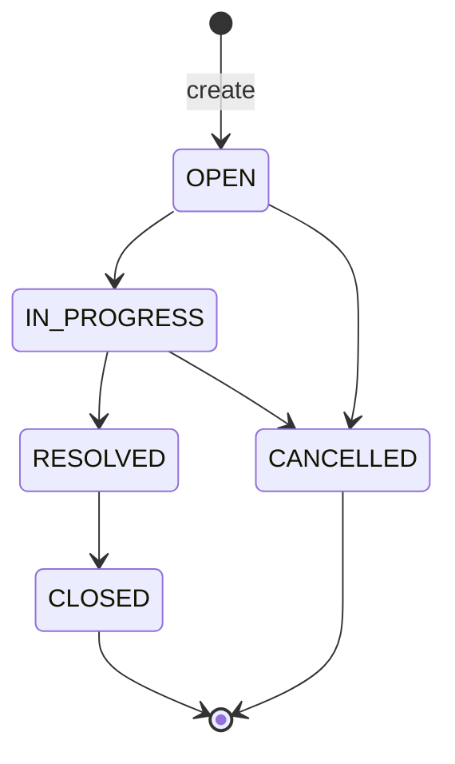

# State machine

The only allowed map is `TicketStatus`. The only write is `PATCH /api/tickets/{ticketId}/status`. Field update cannot set status. Source: [001-support-ticket-management/data-model.md](001-support-ticket-management/data-model.md) and [001-support-ticket-management/research.md](001-support-ticket-management/research.md).

A new ticket starts at `OPEN`. Every pair that is not in the table below is refused with 409, including a request to keep the current status. The stored status does not change. The 25-pair matrix is in the feature data model.

| From | Allowed targets |
|------|-----------------|
| OPEN | IN_PROGRESS, CANCELLED |
| IN_PROGRESS | RESOLVED, CANCELLED |
| RESOLVED | CLOSED |
| CLOSED | none |
| CANCELLED | none |

`CLOSED` and `CANCELLED` have no transition to another status. The screen offers only `allowedNextStatuses` from this map, and offers none for those two statuses. Title, description, priority, assignee, resolution notes, and new comments stay allowed after the ticket is closed or cancelled.
