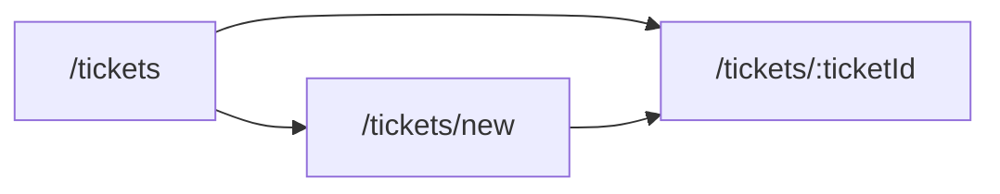

# UI flow

Phase 1 screens. Behavior and error copy are in [001-support-ticket-management/contracts/ui.md](001-support-ticket-management/contracts/ui.md). The client is `frontend/src/api/tickets.ts`. It does not send `page` or `size`, and the UI has no page controls.

| Route | What the agent does |
|-------|---------------------|
| `/tickets` | Scan the queue, search with `q`, filter by one status |
| `/tickets/new` | Create a ticket |
| `/tickets/:ticketId` | Read, edit fields, change status, add a comment |

- The list shows human id, title, status, priority, and assignee, newest first. An empty result says "Nothing matched".
- Create requires title, description, priority, assignee, and category. Resolution notes are optional. Success opens the new ticket. A 400 names each invalid field and does not leave the form.
- Detail shows the ticket, resolution notes, and comments oldest first. The edit form does not send `status` or `category`.
- The status control lists only `allowedNextStatuses`. A 409 shows `detail` and leaves the status unchanged. A missing ticket shows the 404 `detail`.
- Comments can be added in every status, including `CLOSED` and `CANCELLED`. A blank comment is not posted. Priority values `LOW`, `MEDIUM`, and `HIGH` are labeled Low, Medium, and High.
